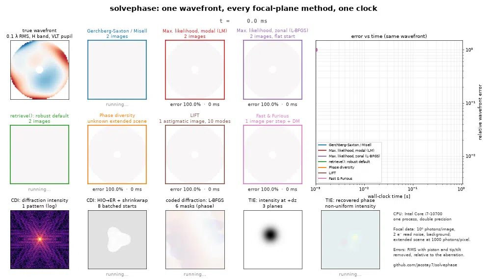

# solvephase

[](https://github.com/jacotay7/solvephase/actions/workflows/ci.yml)
[](https://github.com/jacotay7/solvephase)
[](https://jacotay7.github.io/solvephase/)
[](LICENSE)

**Documentation: [jacotay7.github.io/solvephase](https://jacotay7.github.io/solvephase/)**

**Fast, GPU-optional phase retrieval for adaptive optics, optical metrology and
coherent imaging.**

<p align="center">
  
</p>

`solvephase` recovers phase from intensity. It covers focal-plane wavefront
sensing (Gerchberg–Saxton/Misell, maximum-likelihood modal and zonal
retrieval, phase diversity with unknown extended objects, LIFT, Fast &
Furious), coherent diffraction imaging (ER, HIO, DM, RAAR, RRR, ASR, HPR,
OSS, shrinkwrap), generic measurement models (Wirtinger, truncated,
amplitude and reweighted flows) and the transport-of-intensity equation, all
behind one API. It runs on NumPy by default and on CUDA (CuPy) with one
argument.

## Install

```bash
pip install solvephase                 # CPU
pip install "solvephase[cuda12]"       # + CuPy for CUDA 12.x
pip install "solvephase[cuda13]"       # + CuPy for CUDA 13.x
pip install "solvephase[interop]"      # + pyturb atmospheres and getframes detectors
```

## Quickstart

```python
import solvephase as sp

pupil = sp.Pupil.vlt(128)  # 8 m, obscured, four vanes
model = sp.FocalPlaneModel(
    pupil, 1.65e-6, 64, sampling=2.0, diversity=sp.zernike_diversity(pupil, 4, [0.0, 0.4e-6])
)
truth = sp.random_aberration(pupil, 100e-9, n_modes=40, start=4, seed=1)
images = sp.simulate_images(model, truth, photons=1e6, background=10, read_noise=3, seed=2)

result = sp.retrieve(
    images, pupil, 1.65e-6, sampling=2.0, diversity=[0.0, 0.4e-6], read_noise=3.0, device="auto"
)
print(result.summary())  # converged in a handful of LM steps
result.opd, result.coefficients  # wavefront [m], Zernike [m RMS]
```

`retrieve` is robust by default. It explores with Levenberg–Marquardt on the
amplitude metric from a flat start and from Gerchberg–Saxton, keeps the
better fit, and polishes with the Poisson likelihood. For full control, use
`FocalPlaneProblem` and `solve` (choose the basis, likelihood, nuisance
parameters and optimizer). The other families are one call each:

```python
sp.phase_diversity(model, images_of_extended_scene)  # unknown object
sp.LIFT(pupil, wavelength, 32, sampling=2.0).estimate(img)  # one astigmatic image
sp.FastAndFurious(pupil, wavelength, 64, sampling=2.0).step(img, dm_change)
sp.cdi(magnitudes, support, schedule="hio:500,er:100", starts=16, device="gpu")
sp.tie(stack, [-dz, 0, dz], pitch=pitch, wavelength=wavelength)
```

See **[Choosing an algorithm](https://jacotay7.github.io/solvephase/choosing/)**.

## Highlights

- **Exact derivatives everywhere.** Every propagator (FFT, matrix Fourier
  transform, angular spectrum, coded diffraction) has an exact adjoint.
  Gradients and Gauss–Newton Jacobians are analytic, with no autodiff tape.
  Levenberg–Marquardt typically converges in 5–10 iterations.
- **Statistically efficient.** Poisson + read-noise likelihoods, fitted
  flux, background and registration, masks for bad and saturated pixels.
  The estimator reaches the Cramér–Rao bound in the validation suite.
- **Physically complete.** Broadband light, any sampling (including
  undersampled detectors), pixel integration, segmented apertures, KL
  priors, and DM influence-function bases.
- **Fast on CPU and GPU.** Batched FFTs, matrix Fourier transforms on BLAS,
  batched multi-start CDI, and device-resident optimizers. Single precision
  reaches the same noise floor as double.
- **Validated.** It matches HCIPy to machine precision and the analytic
  Airy normalization, and the validation suite checks its Cramér–Rao
  efficiency and capture range on every CI run.
- **Part of an AO toolchain.** Modal bases come from
  [aobasis](https://github.com/jacotay7/aobasis), realistic aberrations from
  [pyturb](https://github.com/jacotay7/pyturb), and detector frames from
  [getframes](https://github.com/jacotay7/getframes).

## Benchmarks

See the [benchmarks page](https://jacotay7.github.io/solvephase/benchmarks/)
and the versioned artifacts in [`benchmarks/artifacts`](benchmarks/artifacts).

<!-- BENCHMARK TABLE -->

## Validation

`python validation/validate.py` checks solvephase against theory and an
independent code and writes a report; see the
[validation page](https://jacotay7.github.io/solvephase/validation/).

## Development

```bash
pip install -e ".[dev,docs,interop,validation]"
python -m pytest -q                       # fast suite
python -m pytest -q --run-slow --run-gpu  # everything
```

See [CONTRIBUTING.md](CONTRIBUTING.md) and [AGENTS.md](AGENTS.md).

## License

MIT; see [LICENSE](LICENSE).
