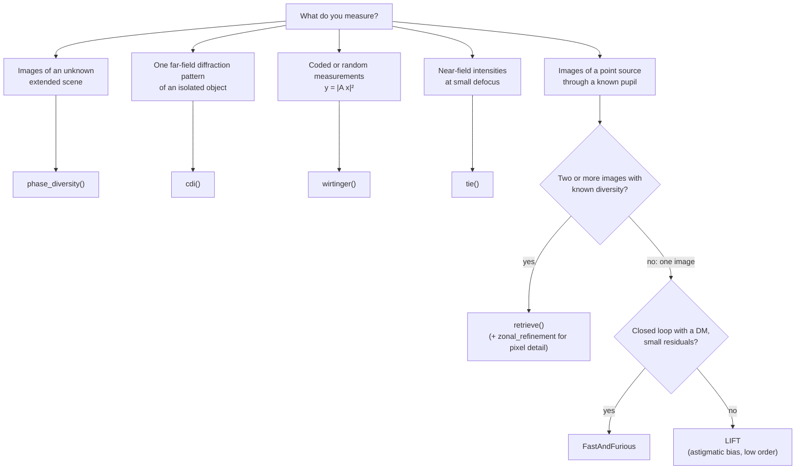

# Choosing an algorithm

This page compares every method in solvephase: what you must measure, what
you must already know, what you get back, and how fast, accurate and robust
each method is. The measured numbers come from one reproducible benchmark
(`benchmarks/methods.py`) in which all focal-plane methods see **the same
wavefront**.

## Decision guide



## At a glance

| Method | You measure | Images | You must know | You get | Noise model | Capture range | Best for |
|---|---|---|---|---|---|---|---|
| [`retrieve()`](guide/focal-plane.md) / maximum likelihood, modal (LM) | point-source images | 2+ (1 if the sign of even modes is known) | pupil, diversity, sampling | modal wavefront + flux, background, registration | Poisson + read noise; reaches the Cramér–Rao bound | from a flat start ≈ 0.2 λ RMS; `retrieve()` ≈ 0.3–0.4 λ RMS with 2 images | NCPA calibration, optical testing, the default |
| Maximum likelihood, zonal (L-BFGS) | point-source images | 2+ | pupil, diversity, sampling | phase per pixel (+ amplitude) | Poisson + read noise | needs a warm start (fits noise from flat) | high-order detail, segment edges, apodization |
| [Gerchberg–Saxton / Misell](guide/focal-plane.md#solvers) | point-source images | 1 (GS) or 2+ (Misell) | pupil, diversity | wrapped phase, unwrapped and fitted to a basis | none (projections) | ≈ 0.2 λ RMS, then stagnates | initialization, quick look |
| [Phase diversity](guide/phase-diversity.md) | images of an **unknown extended scene** | 2+ | pupil, diversity | modal wavefront + the object | Gaussian (Gonsalves/Paxman reduced metric) | ≈ 0.2 λ RMS | solar and extended targets, scene-agnostic sensing |
| [LIFT](guide/ao-wavefront-sensing.md) | one point-source image | 1 | pupil, astigmatism bias | ~10 low-order modes | Poisson + read noise; reaches the Cramér–Rao bound | ≈ 0.2 λ RMS (within its modes) | low-order and tip/tilt sensing on faint sources |
| [Fast & Furious](guide/ao-wavefront-sensing.md) | one image per loop step | 1 per step | pupil, DM steps | phase per pixel, sequentially | weak-phase approximation | ≲ 0.1 λ RMS (weak phase) | real-time NCPA loops with a DM |
| [CDI](guide/cdi.md) | far-field diffraction intensity | 1 | support (or let shrinkwrap find it), oversampling ≥ 2 | complex object | none (projections) | needs random starts | lensless imaging, X-ray/optical CDI |
| [Generic (Wirtinger family)](guide/generic.md) | $y = \lvert A x\rvert^2$ | m ≳ 4–6 n | the operator $A$ (masks, matrix) | complex vector | amplitude or intensity least squares | spectral initialization | coded illumination, research |
| [TIE](guide/tie.md) | near-field intensities | 2–3+ planes | defocus distances, pitch, wavelength | phase map | linearized, non-iterative | weak defocus only | microscopy, curvature sensing |

## Measured comparison

### Focal-plane methods: the same wavefront

| Method | Data needed | Extra requirements | Recovers | CPU | GPU | Error at 0.1 λ RMS |
|---|---|---|---|---|---|---|
| Gerchberg-Saxton / Misell | 2+ images with known diversity | known pupil | zonal phase, unwrapped and fitted to a basis | 434 ms | 300 ms | 1.68 nm (1.1%) |
| Nonlinear ML, modal (LM) | 1+ images; 2+ with diversity to fix the sign | known pupil | modal coefficients + flux, background, registration | 157 ms | 124 ms | 0.82 nm (0.5%) |
| Nonlinear ML, zonal (L-BFGS) | 2+ images with known diversity | known pupil | phase per pixel (+ amplitude) | 491 ms | 1.62 s | 26.06 nm (16.3%) |
| retrieve() (robust default) | 2+ images with known diversity | known pupil | modal (+ optional zonal refinement) | 708 ms | 520 ms | 0.82 nm (0.5%) |
| Phase diversity, extended object | 2+ images of the same scene with known diversity | known pupil; compact scene | modal coefficients + the object | 200 ms | 504 ms | 10.50 nm (6.6%) |
| LIFT | 1 image with a known astigmatism bias | known pupil | ~10 low-order modes | 47 ms | 78 ms | 42.99 nm (26.9%); 6.76 nm on its 10 modes |
| Fast & Furious | 1 image per step, in closed loop | a DM; small residuals; symmetric pupil | zonal phase (sequential) | 16 ms | 28 ms | 19.02 nm (11.9%) |

### Capture range (same pupil and noise, 6 random wavefronts per level)

Success rate (final error < 20 % of the aberration) versus aberration RMS:

| Method | 0.05 λ | 0.1 λ | 0.2 λ | 0.3 λ | 0.4 λ | 0.5 λ | 0.7 λ |
|---|---|---|---|---|---|---|---|
| Gerchberg-Saxton / Misell | 100 % | 100 % | 100 % | 17 % | 33 % | 17 % | 0 % |
| Nonlinear ML, modal (LM) | 100 % | 100 % | 100 % | 33 % | 17 % | 0 % | 0 % |
| Nonlinear ML, zonal (L-BFGS) | 0 % | 100 % | 33 % | 0 % | 0 % | 0 % | 0 % |
| retrieve() (robust default) | 100 % | 100 % | 100 % | 100 % | 83 % | 50 % | 50 % |
| Phase diversity, extended object | 100 % | 83 % | 100 % | 67 % | 33 % | 33 % | 0 % |
| LIFT | 100 % | 100 % | 100 % | 67 % | 17 % | 0 % | 0 % |
| Fast & Furious | 100 % | 100 % | 0 % | 0 % | 0 % | 0 % | 0 % |

### Other measurement models

| Method | Data needed | Requirements | Recovers | CPU | GPU | Error |
|---|---|---|---|---|---|---|
| CDI: HIO→ER + shrinkwrap, 8 starts | 1 oversampled diffraction pattern | isolated object (oversampling ≥ 2) | complex object | 951 ms | 277 ms | 9.2e-04 (relative) |
| Generic: L-BFGS (coded diffraction, 6 masks) | 6 coded diffraction patterns | known random masks (m/n ≳ 4) | complex vector | 142 ms | 169 ms | 1.9e-08 (relative) |
| TIE (non-uniform intensity, DCT) | 3 intensities at ±dz | weak defocus; sample inside the field | phase map | 4 ms | 4 ms | 4.5e-02 (relative) |

## How to read this

- **Accuracy at a standard SNR.** Every focal-plane method sees a VLT-like
  pupil with 0.1 λ RMS of aberration over Zernike modes 4–33, 10⁶ photons
  per image and 2 e⁻ read noise. Errors are RMS with piston and tip/tilt
  removed.
- **Each method gets its natural data.** Two defocus-diverse images, one
  astigmatic image (LIFT), an extended scene (phase diversity), or a closed
  loop of 30 frames with a DM (Fast & Furious).
- **LIFT and Fast & Furious are limited by their models, not the noise.**
  LIFT measures only its ~10 low-order modes, so the table also gives its
  error on those modes. Fast & Furious levels off near 10 % because the
  weak-phase approximation discards signal in the dark Airy rings.
- **Zonal L-BFGS from a flat start converges slowly and fits noise.** Use it
  to refine a modal solution: `retrieve(..., zonal_refinement=True)`.
- **Gerchberg–Saxton output is fitted to 36 Zernikes.** Zonal GS fits photon
  noise into pupil frequencies the data barely constrain (32 % error zonal
  versus 1 % fitted, on this problem). Pass `basis=` to `gerchberg_saxton`.
- **Speed.** Times are warm (setup excluded), on an Intel i7-10700 (CPU,
  double precision) and an entry-level NVIDIA Quadro P620 (GPU, single
  precision). At this 64×64 size the GPU is launch-bound; GPU advantages
  grow with problem size (see [Benchmarks](benchmarks.md)).
- **Capture range.** A run counts as a success when its final error is
  below 20 % of the aberration. LIFT is tested on aberrations within its own
  modes. The threshold is relative, so a method whose noise floor is a fixed
  number of nanometres (zonal L-BFGS from a flat start) can fail on the
  *smallest* aberrations while succeeding at moderate ones. `retrieve()`
  extends the range by trying a Gerchberg-Saxton start as well as a flat one;
  beyond about 0.4 λ RMS, use larger diversity or more planes.

Reproduce:

```bash
python benchmarks/methods.py --output methods.json
python benchmarks/methods.py --markdown methods.json
```

## Practical tips

- **Known noise model:** keep `loss="poisson"`, pass `read_noise` in
  electrons, convert images to photo-electrons, and mask saturated pixels
  (see [interoperability](guide/interop.md)).
- **Broadband light:** pass an array of wavelengths (and
  `spectral_weights`); the model sums monochromatic PSFs exactly.
- **Undersampled detectors:** give the true `sampling` (< 2) and
  `oversample=2` or more for pixel integration.
- **Segmented telescopes:** use `Basis.segments(pupil)` for piston, tip and
  tilt per segment, and several wavelengths to resolve 2π piston ambiguities.
- **Turbulence-like wavefronts:** `Basis.kl(pupil, n, r0=...)` with
  `prior=True` gives a maximum a posteriori estimate.
- **Large aberrations:** use larger diversity or three planes (−d, 0, +d).
